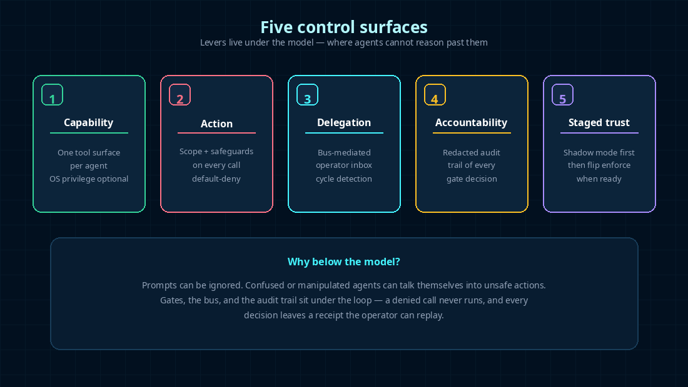
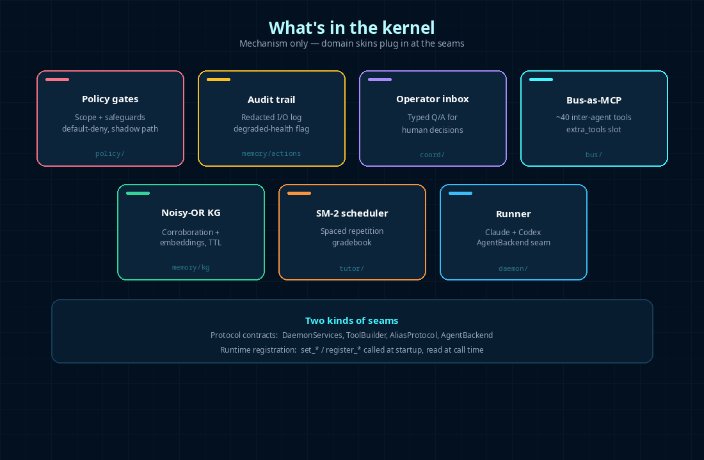
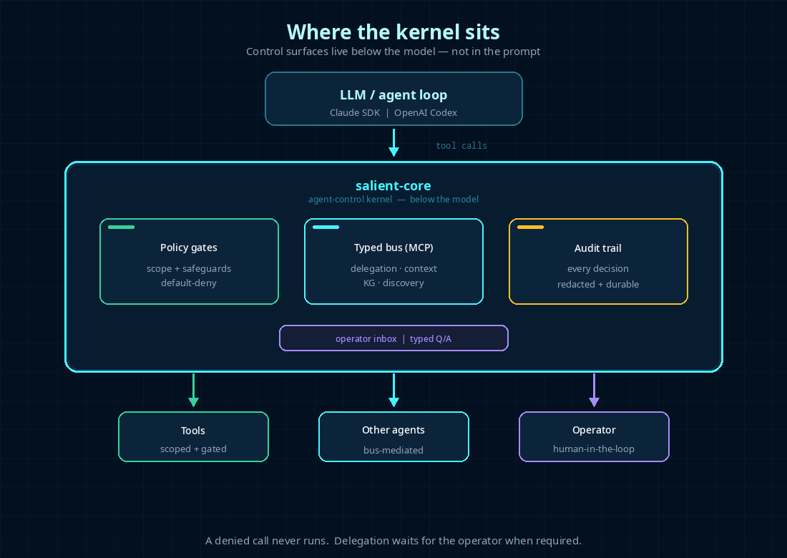
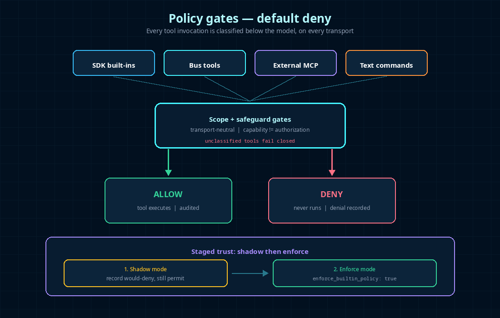
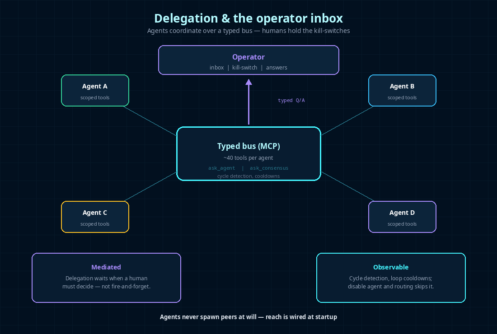
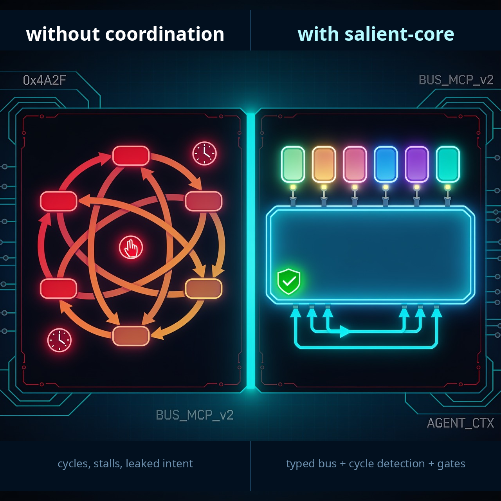

# salient-core

**An agent-control kernel for multi-agent systems. We optimize for what agents *can't* do.**

[](https://github.com/baggybin/salient-core/actions/workflows/ci.yml)
[](LICENSE)


Most AI frameworks focus on giving agents more capabilities. `salient-core`
focuses on **proving what they actually did**, and **stopping them from doing
what they shouldn't**. It sits below the LLM — between the model and your
tools — as a **default-deny control kernel**.

> Let agents act on your infrastructure, but never outside the box you drew —
> and always keep the receipts.

**Showcase:** [salient-tutor](https://github.com/baggybin/salient-tutor) — a
Socratic teaching agent built on this kernel.

---

## The problem

Right now, most stacks secure agents with system prompts like *"please don't
delete that folder"* or *"be careful with production."* That is **probabilistic
safety**. If the model hallucinates, is manipulated, or simply gets over-eager,
nothing *underneath* the loop enforces the rule — the destructive tool call
still runs.

Orchestrators (LangGraph, CrewAI, AutoGen, …) excel at composing workflows and
roles. They do not put a **transport-neutral, default-deny gate** under every
tool invocation, across SDK built-ins, MCP, bus tools, and model-emitted text.

## The solution

`salient-core` moves control out of the prompt and into the kernel. Every tool
call passes through **scope + safeguard gates** *before* anything executes.
Capability exposure and authorization are separate: enabling a tool never
implicitly authorizes it. Unclassified tools fail closed. A denied call
**never runs**.

Delegation is bus-mediated and operator-visible. Anything that needs a human
lands in a typed **operator inbox** and waits. Every gate decision and tool
I/O is persisted — secrets redacted — so you can reconstruct what happened.

<p align="center">
  
</p>

---

## Core features

| | |
|---|---|
| **Default-deny policy gates** | Scope + safeguards on every tool call, under the model. Transport-neutral: SDK built-ins, bus tools, external MCP, text commands. Shadow mode first, then flip `enforce_builtin_policy: true`. |
| **Operator inbox** | Typed Q/A for human decisions. Delegation and policy walls become tickets — not silent failures or free rein. |
| **Redacted audit trail** | Replayable record of gate decisions and tool I/O. Secrets redacted; if a record can't be written, the store flags itself degraded rather than staying quiet. |
| **Typed MCP bus** | ~40 inter-agent tools (delegation, context, KG, discovery, audit) as one MCP server per agent, plus `extra_tools` for domain add-ons. |
| **Noisy-OR knowledge graph** | Cross-session memory with corroboration, embeddings, subject namespaces, provenance, and archive-first compaction. |
| **Dual runners** | Claude Agent SDK by default; optional OpenAI Codex via `salient-core[codex]` (same bus, same gates). Further providers plug in behind `AgentBackend`. |
| **Per-agent isolation** | One tool surface per agent; optional OS privilege separation via `_launch_profile`. |

<p align="center">
  
</p>

---

## Architecture

Every agent runs its own provider loop with a **bus MCP server** attached.
Tool calls hit the gates first; human decisions hit the inbox; learning lands
in the shared KG. The kernel's value is this topology, not any one box.

```
LLM / agent loop
       │  tool calls
       ▼
┌──────────────────────────────┐
│        salient-core          │
│  policy gates · typed bus    │
│  audit trail · operator inbox│
└──────────────────────────────┘
   │            │            │
   ▼            ▼            ▼
 Tools      Other agents   Operator
(scoped)   (bus-mediated)  (typed Q/A)
```

<p align="center">
  
</p>

<p align="center">
  
</p>

<p align="center">
  
</p>

<p align="center">
  
</p>

Full data-flow, persistence model, and seams:
[`docs/ARCHITECTURE.md`](docs/ARCHITECTURE.md) ·
hardening log:
[`docs/KERNEL-HARDENING-v0.6.0.md`](docs/KERNEL-HARDENING-v0.6.0.md).

---

## Where it sits (not another orchestrator)

| | salient-core | LangGraph | CrewAI / AutoGen |
|---|---|---|---|
| **Optimizes for** | operator control over agents | workflow expressiveness | role-based collaboration |
| **Coordination** | typed **MCP bus** per agent | in-process state graph | in-process agent/role objects |
| **Policy / gating** | **default-deny below the model**, every call | prompt- / code-level | prompt-level convention |
| **Human-in-the-loop** | first-class **operator inbox** | interrupts / checkpoints | optional human proxy |
| **Audit** | **redacted, replayable** gate + tool trail | app-level logging | app-level logging |
| **Memory** | **noisy-OR KG** + corroboration | checkpointer state | external add-ons |

Use an orchestrator to *compose* LLM calls. Use this kernel when agents must
be *constrained* — and you need receipts.

**When *not* to use it:** single-agent toys (control-plane overhead), providers
beyond Claude/Codex today (seam exists; nothing else ships yet), or if you want
a hosted no-code runtime. This is a **library kernel** you wire into your own
daemon.

---

## Requirements

- **Python ≥ 3.11, < 3.14**
- **[`claude-agent-sdk`](https://pypi.org/project/claude-agent-sdk/) `>=0.2.110,<0.3`**
  (pulled in automatically). Claude access via `ANTHROPIC_API_KEY` or an
  existing Claude Code OAuth session.
- Optional: `pip install 'salient-core[codex]'` for the OpenAI Codex runner
  (same bus + gates; your own Codex/OpenAI auth).

> **Default-deny, out of the box.** Empty scope/safeguard datasets mean an
> engagement with no policy set refuses **every** tool call. Populate
> `ScopeStore` / `SafeguardConfig` at startup (see
> [`docs/EXTRACTION.md`](docs/EXTRACTION.md#data-tables)) before agents can act.
> Policy is opt-in-safe on purpose.

---

## Quick start

### 1. Install

```bash
pip install salient-core
```

### 2. Run the multi-agent showcase (no API key)

Fans one prompt across a panel over the bus, captures each leg, and scores
**semantic convergence** — real `ask_consensus` machinery, offline:

```bash
pip install salient-core starlette uvicorn
cd examples/consensus_panel
uvicorn server:app --reload      # → http://127.0.0.1:8055
```

See [`examples/consensus_panel/`](examples/consensus_panel/README.md) to swap
the mock runner for live models. Full app on the kernel:
[`salient-tutor`](https://github.com/baggybin/salient-tutor).

### 3. Use a standalone module

Some pieces work without the full daemon — e.g. the SM-2 scheduler:

```python
from salient_core.tutor.schedule import next_interval_days, next_mastery

interval = next_interval_days(prev_days=7.0, grade="good")  # → ~16.1
mastery = next_mastery(prev_mastery=0.5, grade="easy")      # → ~0.75
```

---

## Configuration & seams

The kernel ships **no app-specific ("skin") code**. A downstream daemon fills
two kinds of plug-in points at startup:

1. **Protocol contracts** — `DaemonServices`, `ToolBuilder`, `AliasProtocol`,
   `AgentBackend` (`salient_core.protocols`).
2. **Runtime registration** — `set_*` / `register_*` functions read at *call
   time* (never import time), each with a safe default.

```python
from pathlib import Path
from salient_core.protocols import DaemonServices
from salient_core.memory.kg import KnowledgeGraph
from salient_core.coord.questions import QuestionInbox
from salient_core.bus._context_store import ContextStore
from salient_core.bus import make_bus

class MyDaemon:
    """Downstream implements DaemonServices; runner only touches this surface."""
    profile: dict = {}
    engagement_path: Path | None = None
    context: ContextStore
    kg: KnowledgeGraph
    inbox: QuestionInbox

    def add_question(self, agent: str, question: str, job_id: int | None = None) -> int:
        return self.inbox.add(agent=agent, text=question, job_id=job_id)

# Each agent gets its own bus MCP server (gates + typed tools).
daemon = MyDaemon(...)  # wire stores at startup
bus_server, server_name, wire_names = make_bus(daemon, agent_name="researcher")
```

Full extension guide: [`docs/EXTRACTION.md`](docs/EXTRACTION.md). Seam
catalogue: [`docs/ARCHITECTURE.md`](docs/ARCHITECTURE.md).

---

## Status

Pre-alpha. APIs are evolving. See [`CHANGELOG.md`](CHANGELOG.md).

## Contributing

Kernel changes land **here first**. Public API is guarded by
`tests/test_public_api.py`; new capabilities go through Protocol contracts and
`set_*` seams — not domain specifics baked into the kernel.

```bash
git clone https://github.com/baggybin/salient-core.git
cd salient-core
pip install -e ".[dev]"
pre-commit install
pytest tests/ -q
```

See [`CONTRIBUTING.md`](CONTRIBUTING.md).

## License

Apache 2.0 — see [`LICENSE`](LICENSE).

---

*Built for constrained multi-agent systems on the Model Context Protocol (MCP).*
